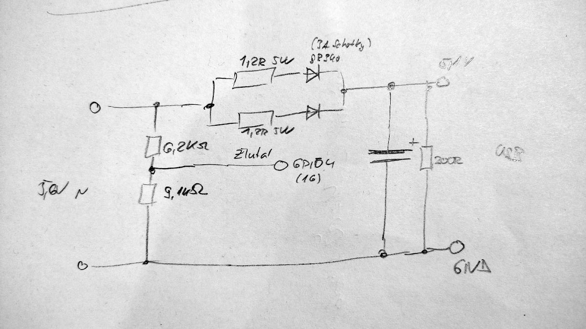
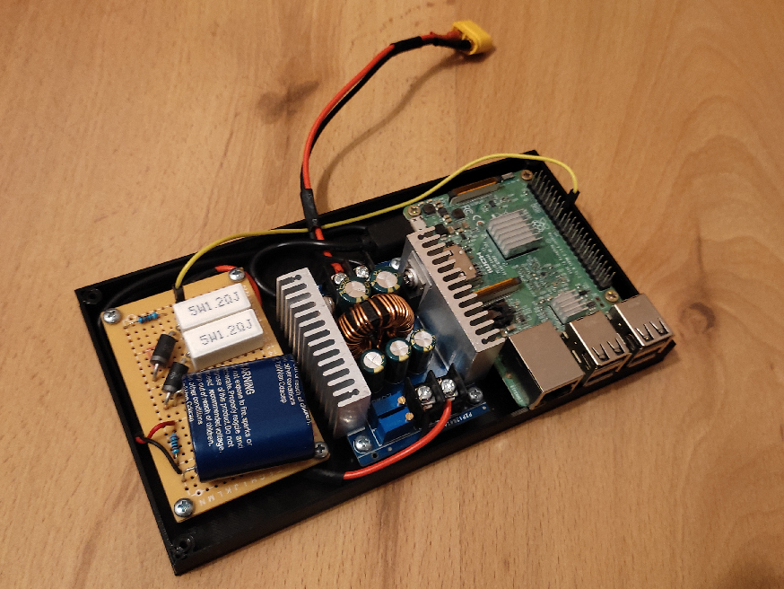
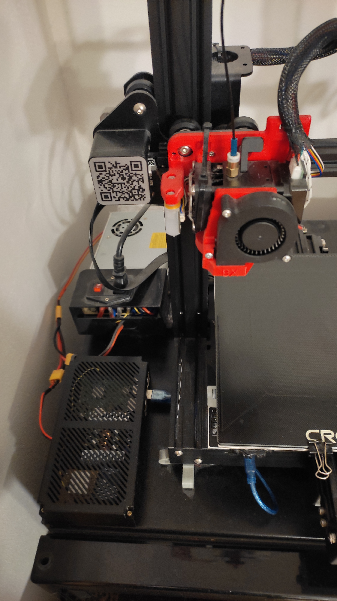

# Graceful poweroff for octoprint RPi

A simple capacitor-based board that is powered from Ender 3D power source (via a buck convertor) and provides safe poweroff information for a Raspberry PI.

## Quick hand-drawn schematics

The supercap is a 5.5 V 15 F capacitor.

The poweroff script and rc.local modifications for RPi are included

## Final make photos

